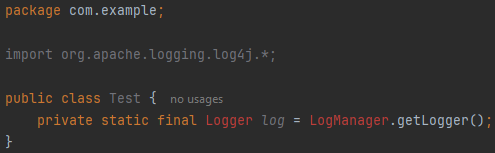
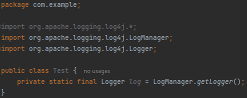

# IDEA 2024.1 Java wildcard imports not recognized in submodules
Sample project to reproduce IDEA-350754:

https://youtrack.jetbrains.com/issue/IDEA-350754/IDEA-2024.1-Java-wildcard-imports-not-recognized-in-submodules

Intellij did not recognizing wildcard imports in class com.example.Test.java:

Direct import with full path is working:

